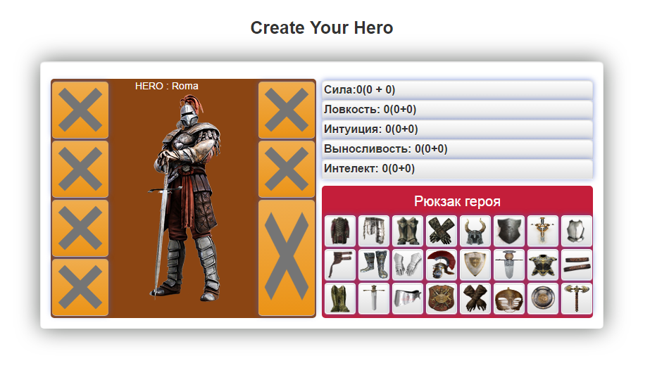

# Games Hero
Создание героя.
Возможность одевать вещи из рюкзака / снимать вещи в рюкзак.
Одетые вещи дают новые статы герою - увеличивая или снижая их.
Статы отражены в отдельном окне., в зависимости от типа оружия, вещей - изменяются. 

## Development server
Run `ng serve` for a dev server. Navigate to `http://localhost:4200/`.
The app will automatically reload if you change any of the source files.

Button

